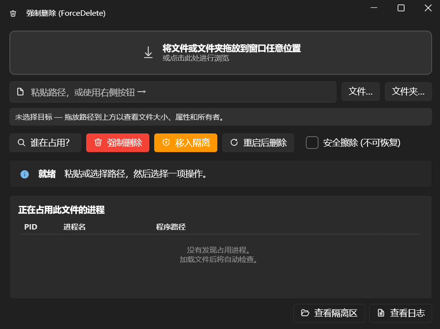

# ForceDelete Pro (强制删除增强版) 🛡️

这是一个小巧、**便携**的 Windows 工具，用于删除 Windows 禁止删除的文件。它是原版 ForceDelete 的**专业增强版**，集成了“特权夺取”、“深度锁定检测”和“智能窗口匹配”等核心技术。

> [!TIP]
> **Pro 版特性**：本项目在原版基础上增加了递归占用扫描、记事本类程序窗口匹配、以及 Shell 自动刷新通知功能。

[English Version (README.md)](./README.md)

---

## 🖼️ 界面截图



## 🛠️ 功能说明

| 删除失败的原因 | ForceDelete Pro 的处理方式 |
|---|---|
| 受系统或 TrustedInstaller 保护 | 启用 `SeTakeOwnership` 权限，夺取所有权并授予管理员完全控制权 |
| 只读 / 隐藏 / 系统属性 | 先行清除所有文件属性标记 |
| 被正在运行的进程占用 | **显示具体的占用进程**（通过重启管理器）并可一键结束重试 |
| **深层子文件锁定** ✨ | **[PRO]** 递归扫描文件夹内所有项目，找出躲在子文件夹里的占用进程 |
| **“软”锁定 (如记事本)** ✨ | **[PRO]** 通过匹配窗口标题识别那些没有产生系统句柄锁的程序 |
| 被操作系统本身锁定 | 安排在下次重启时自动删除 (`MoveFileEx`) |
| **深层 UI 视觉优化** ✨ | **[PRO]** 解决了深色模式下列表看不清的问题，采用高对比度橙色主题 |
| **资源管理器残影** ✨ | **[PRO]** 触发 `SHChangeNotify` 强制 Windows 立即刷新视图 |
| 驱动商店中的驱动包 | 调用 `pnputil /delete-driver` 进行正规卸载与删除 |
| 超长路径 (>260) / 保留名称 | 使用 `\\?\` 扩展长度前缀处理 |
| 敏感数据泄露风险 | 提供可选的安全擦除（随机数据覆盖）功能 |

## ✨ 特色功能与 Pro 改进

- **拖拽支持**：支持将文件或文件夹拖放到窗口任意位置。
- **自动扫描**：加载路径后立即显示大小、属性、所有者及占用进程。
- **隔离区**：提供“先移动再清理”的缓冲机制，防止误删。
- **安全卫士**：禁止或二次确认对 `Windows`、`System32` 等核心目录的删除。
- **递归占用发现 [PRO]**：自动深挖子目录，彻底查清父文件夹被锁定的真正原因。
- **窗口智能匹配 [PRO]**：支持识别并关闭**记事本**等不产生传统锁定的程序窗口。
- **Shell 自动刷新 [PRO]**：删除成功后自动通知系统刷新，图标瞬间消失。
- **操作日志**：每一项删除、结束进程或隔离操作都会被详细记录。

## 🔑 权限提升机制

程序窗口在**普通用户**级别运行，因此从资源管理器拖拽文件非常顺畅。当操作确实需要管理员权限时，应用会启动一个短周期的**提升权限助手进程**（仅需一次 UAC 授权），并在操作完成后汇报结果。

## 📋 运行要求

- Windows 10/11 x64
- .NET 10 SDK — **仅编译需要**；生成的 `.exe` 是自包含的单文件
- 管理员账户（用于按需权限提升）

## 🏗️ 编译与发布

```powershell
# 编译 (开发模式)
dotnet build

# 发布为单文件便携版
dotnet publish -c Release -o .\dist
```

## 📂 项目布局

```text
ForceDelete-Pro/
├─ app.manifest             # 权限声明 + 长路径支持
├─ icon.ico                 # 程序图标
├─ MainWindow.xaml(.cs)     # 界面 + 智能窗口匹配与自动结束逻辑
└─ Services/
   ├─ DeleteEngine.cs       # 核心引擎：所有权、ACL、属性 + Shell 刷新通知
   ├─ RestartManager.cs     # 增强版递归锁定扫描引擎
   ├─ Elevation.cs          # GUI 与提升权限助手进程的桥梁
   ├─ Privileges.cs         # 启用夺取所有权/备份/恢复特权
   ├─ DriverStore.cs        # 基于 pnputil 的驱动包移除
   ├─ SafetyGuard.cs        # 核心目录保护 + 进程强制终止
   ├─ Storage.cs            # 便携式数据存储路径管理
   └─ Logger.cs             # 增量操作日志
```

## 💻 技术栈

- 基于 .NET 10 的 WPF (`net10.0-windows`)
- [WPF-UI](https://github.com/lepoco/wpfui) 提供 Fluent / Mica 设计风格
- Win32 API 调用：重启管理器、权限调整、`MoveFileEx`、`SHChangeNotify`

## 📄 授权协议

MIT — 详见 [LICENSE](LICENSE)。基于原版 ForceDelete 进行增强开发。
